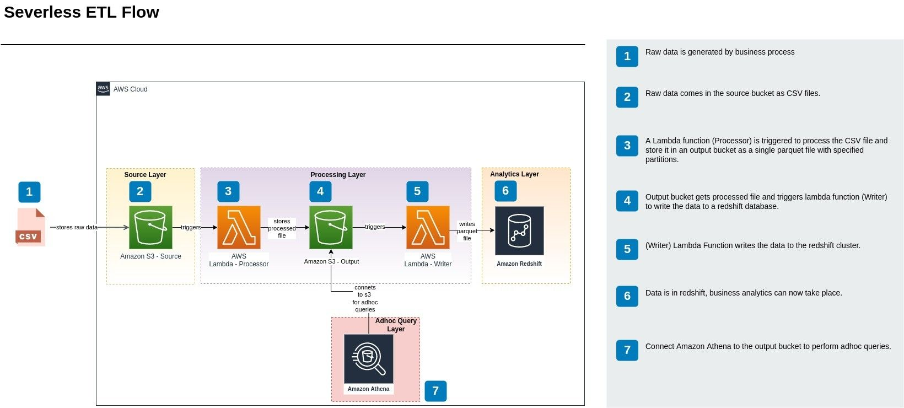

# Description
This repository contains code that aims to achieve the ETL data pipeline shown below.

The pipeline contains the following:
- 2 storage buckets
- 2 lambda functions for processing data
- An Amazon Redshift Cluster
ETL Serverless data pipeline.

## Libraries
- pre-commit
- yapf
- pandas
- pytest
- tox


## Setup
1. Clone the repository
2. Change into the project directory and run
```bash
poetry init
```
3. To activate and use the app's virtual environment, enter the command below in the terminal
```bash
poetry shell
```

4. Run the command below to load the hooks defined in `.pre-commit-config.yaml`.
```bash
pre-commit install
```

Now when changes are committed to a branch, `pre-commit` runs the defined hooks on that branch. Changes will likely not be committed the first time if code is not properly formatted or if a test fails, as specified by the hooks in this case. `pre-commit` will attempt to reformat the code using the installed `yapf` formatter, but any issues with tests has to be rectified manually. When all issues are resolved, changes will then be committed after running a `git add` command, and then a commit command.
